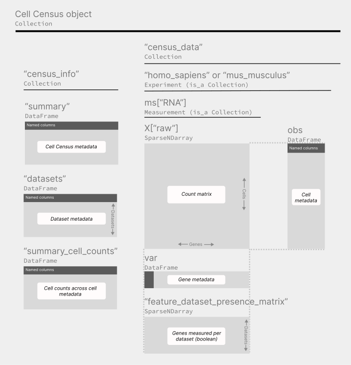

[](https://codecov.io/gh/chanzuckerberg/cell-census)

# Cell Census of CZ CELLxGENE Discover

[**CZ CELLxGENE Discover**](https://cellxgene.cziscience.com/)  is a free-to-use data portal hosting a growing corpus of more than **700 single-cell datasets** comprising about **50 million cells** from the major human and mouse tissues. The portal provides a set of visual tools to download and explore the data. **All data is [standardized](https://github.com/chanzuckerberg/single-cell-curation/tree/main/schema/3.0.0)** to include raw counts and a common vocabulary for gene and cell metadata.

The **Cell Census** provides easy-to-use and efficient computational tooling to access, query, and analyze all RNA data from CZ CELLxGENE Discover. The Cell Census aims to break the barrier of data fragmentation in the single-cell field by presenting a **new access paradigm of cell-based slicing and querying** for all data at CZ CELLxGENE Discover.

Get started on using the Cell Census:

- [Quick start](#Quick-start).
- [Documentation](https://chanzuckerberg.github.io/cell-census/index.html). *Under development.*
- [Python tutorials](https://github.com/chanzuckerberg/cell-census/tree/main/api/python/notebooks).
- R tutorials. *Coming soon.*

## Motivation: Single-cell analysis at scale 

The **Cell Census** is a data object publicly hosted online and a convenience API to open it. The object is built using the [SOMA](https://github.com/single-cell-data/SOMA) API and data model via its implementation [TileDB-SOMA](https://github.com/single-cell-data/TileDB-SOMA). As such, the Cell Census has all the data capabilities offered by TileDB-SOMA including:

- Cloud-based data storage and access.
- Efficient access for larger-than-memory slices of data.
- Data streaming for iterative/parallelizable  methods.
- R and Python support.
- Export to AnnData and Seurat.

## Cell Census data releases

Starting in  mid 2023, Cell Census long-term supported data builds will be released every 6 months and and will be publicly accessible for at least 5 years upon release. 

In between long-term supported data build releases, weekly builds are released without any guarantee of permanence. 

## Cell Census data organization

The Cell Census follows a specific [data schema](https://github.com/chanzuckerberg/cell-census/blob/main/docs/cell_census_schema.md). Briefly, the Cell Census is a collection of a variety of **SOMA** objects organized with the following hierarchy.




## Quick start

### Requirements

The Cell Census requires a Linux or MacOS system with:

- Python 3.7 to Python 3.10. Or R, supported versions TBD.
- Recommended: >16 GB of memory.
- Recommended: >5 Mbps internet connection. 
- Recommended: for increased performance use the API through a AWS-EC2 instance from the region `us-west-2`. The Cell Census data builds are hosted in a AWS-S3 bucket in that region.

### Documentation

The Cell Census [doc-site](https://chanzuckerberg.github.io/cell-census/index.html) *under development*, contains the reference documentation, data description, and tutorials.

Reference documentation can also be accessed directly from Python or R.


### Python quick start

#### Installation

It is recommended to install the Cell Census and all of its dependencies in a new virtual environment via `pip`:

```
pip install -U cell-census
```

#### Usage examples

Demonstration notebooks can be found [here](https://github.com/chanzuckerberg/cell-census/tree/main/api/python/notebooks).

Below are 3 examples of common operations you can do with the Cell Census. As a reminder, the reference documentation for the API can be accessed via `help()`:

```python
import cell_census

help(cell_census)
help(cell_census.get_anndata)
# etc
```

**Querying a slice of cell metadata.**

The following reads the cell metadata and filters `female` cells of cell type `microglial cell` or `neuron`, and selects the columns `assay`, `cell_type`, `tissue`, `tissue_general`, `suspension_type`, and `disease`.

```python
import cell_census

with cell_census.open_soma() as census:
    
    # Reads SOMA data frame as a slice
    cell_metadata = census["census_data"]["homo_sapiens"].obs.read(
        value_filter = "sex == 'female' and cell_type in ['microglial cell', 'neuron']",
        column_names = ["assay", "cell_type", "tissue", "tissue_general", "suspension_type", "disease"]
    )
    
    # Concatenates results to pyarrow.Table
    cell_metadata = cell_metadata.concat()
    
    # Converts to pandas.DataFrame
    cell_metadata = cell_metadata.to_pandas()
    
    print(cell_metadata)
```

The output is a `pandas.DataFrame` with about 300K cells meeting our query criteria and the selected columns.

```bash
            assay        cell_type           tissue tissue_general suspension_type disease     sex
0       10x 3' v3  microglial cell              eye            eye            cell  normal  female
1       10x 3' v3  microglial cell              eye            eye            cell  normal  female
2       10x 3' v3  microglial cell              eye            eye            cell  normal  female
3       10x 3' v3  microglial cell              eye            eye            cell  normal  female
4       10x 3' v3  microglial cell              eye            eye            cell  normal  female
...           ...              ...              ...            ...             ...     ...     ...
299617  10x 3' v3           neuron  cerebral cortex          brain         nucleus  normal  female
299618  10x 3' v3           neuron  cerebral cortex          brain         nucleus  normal  female
299619  10x 3' v3           neuron  cerebral cortex          brain         nucleus  normal  female
299620  10x 3' v3           neuron  cerebral cortex          brain         nucleus  normal  female
299621  10x 3' v3           neuron  cerebral cortex          brain         nucleus  normal  female

[299622 rows x 7 columns]
```

##### Obtaining a slice as AnnData 

The following creates an `anndata.AnnData` object on-demand with the same cell filtering criteria as above and filtering only the genes `ENSG00000161798`, `ENSG00000188229`. This object can be then used for downstream analysis using [scanpy](https://scanpy.readthedocs.io/en/stable/).

```python
import cell_census

with cell_census.open_soma() as census:
    adata = cell_census.get_anndata(
        census = census,
        organism = "Homo sapiens",
        var_value_filter = "feature_id in ['ENSG00000161798', 'ENSG00000188229']",
        obs_value_filter = "sex == 'female' and cell_type in ['microglial cell', 'neuron']",
        column_names = {"obs": ["assay", "cell_type", "tissue", "tissue_general", "suspension_type", "disease"]},
    )
    
    print(adata)
    
```

The output with about 300K cells and 2 genes can be now used for downstream analysis using [scanpy](https://scanpy.readthedocs.io/en/stable/).

``` bash
AnnData object with n_obs × n_vars = 299622 × 2
    obs: 'assay', 'cell_type', 'tissue', 'tissue_general', 'suspension_type', 'disease', 'sex'
    var: 'soma_joinid', 'feature_id', 'feature_name', 'feature_length'
```

##### Memory-efficient queries

This example provides a demonstration to access the data for larger-than-memory operations using **TileDB-SOMA** operations. 

First we initiate a lazy-evaluation query to access all brain and male cells from human. This query needs to be closed — `query.close()` — or used called in a context manager — `with ...`.

```python
import cell_census

with cell_census.open_soma() as census:
    
    human = census["census_data"]["homo_sapiens"]
    query = human.axis_query(
    measurement_name = "RNA",
    obs_query = tiledbsoma.AxisQuery(
        value_filter = "tissue == 'brain' and sex == 'male'"
   )
   
   # Continued below

```

Now we can iterate over the matrix count, as well as the cell and gene metadata. For example, to iterate over the matrix count, we can get an iterator and perform operations for each iteration.

```python
    # Continued from above 
    
    iterator = query.X("raw").tables()
    
    # Get an iterative slice as pyarrow.Table
    raw_slice = next (iterator) 
    ...
```

And you can now perform operation on each iteration slice. As with any any Python iterator this logic can be wrapped around a `for` loop.

And you must close the query.

```
   # Continued from above 
   
   query.close()
```

### R quick start

*Coming soon*


## Questions, feedback and issues

- Questions: we encourage you to ask questions via [github issues](https://github.com/chanzuckerberg/cell-census/issues). Alternatively, for quick support you can join the C[ZI Science Community](https://join-cellxgene-users.herokuapp.com/) on Slack and join the `#cell-census-users` channel
- Bugs: please submit a [github issue](https://github.com/chanzuckerberg/cell-census/issues). 
- Feature requests: please submit requests using this [form](https://airtable.com/shrVV1g0d6nvBoQYu).
- Security issue: if you believe you have found a security issue, we would appreciate notification. Please send an email to <security@chanzuckerberg.com>.
- You can send any other feedback to <soma@chanzuckerberg.com>


## Coming soon

- R support!
- We are currently working on creating the tooling necessary to perform data modeling at scale with seamless integration of the Cell Census and [PyTorch](https://pytorch.org/).
- To increase the usability of the Cell Census for research, in 2023 and 2024 we are planning to explore the following areas :
   - Organism-wide normalization
   - Organism-wide embeddings
   - Smart subsampling

## Projects and tools using the Cell Census

If you are interested in listing a project here, please reach out to us at <soma@chanzuckerberg.com>

## Reuse

The contents of this Github repository are freely available for reuse under the [MIT license](https://opensource.org/licenses/MIT). Data in the Cell Census are available for re-use under the [CC-BY license](https://creativecommons.org/licenses/by/4.0/).


## Code of Conduct

This project adheres to the Contributor Covenant [code of conduct](https://github.com/chanzuckerberg/.github/blob/master/CODE_OF_CONDUCT.md). By participating, you are expected to uphold this code. Please report unacceptable behavior to <opensource@chanzuckerberg.com>.

