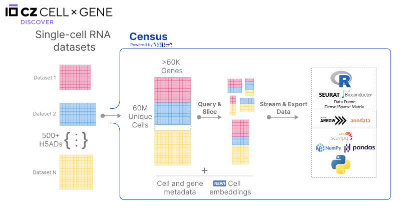

 🚀 New to the Census: we’ve created a **centralized hub of models and embeddings** using Census data. [Check it out](https://cellxgene.cziscience.com/census-models)!

 

# CZ CELLxGENE Discover Census

The Census provides efficient computational tooling to **access, query, and analyze all single-cell RNA data from CZ CELLxGENE Discover**. Using a new access paradigm of cell-based slicing and querying, you can interact with the data through TileDB-SOMA, or get slices in AnnData, Seurat, or SingleCellExperiment objects, thus accelerating your research by significantly minimizing data harmonization.

Get started:

- [Quick start (Python and R)](cellxgene_census_docsite_quick_start.md)
- [Census data and schema](cellxgene_census_docsite_schema.md)
- [Python tutorials](examples.rst)
- [R tutorials](https://chanzuckerberg.github.io/cellxgene-census/r/articles/)
- [Github repository](https://github.com/chanzuckerberg/cellxgene-census)

## Citing Census

To cite the project please follow the [citation guidelines](https://cellxgene.cziscience.com/docs/08__Cite%20cellxgene%20in%20your%20publications) offered by CZ CELLxGENE Discover.

To cite individual studies please refer to the tutorial [Generating citations for Census slices](notebooks/api_demo/census_citation_generation.ipynb).

## Census Capabilities

The Census is a data object publicly hosted online and an API to open it. The object is built using the [SOMA](https://github.com/single-cell-data/SOMA) API specification and data model, and it is implemented via [TileDB-SOMA](https://github.com/single-cell-data/TileDB-SOMA). As such, the Census has all the data capabilities offered by TileDB-SOMA including:

**Data access at scale:**

- Cloud-based data access.
- Efficient access for larger-than-memory slices of data.
- Query and access data based on cell or gene metadata at low latency.

**Interoperability with existing single-cell toolkits:**

- Load and create [AnnData](https://anndata.readthedocs.io/en/latest/) objects.
- Load and create [Seurat](https://satijalab.org/seurat/) objects.
- Load and create [SingleCellExperiment](https://bioconductor.org/packages/release/bioc/html/SingleCellExperiment.html) objects.

**Interoperability with existing Python or R data structures:**

- From Python create [PyArrow](https://arrow.apache.org/docs/python/index.html) objects, SciPy sparse matrices, NumPy arrays, and pandas data frames.
- From R create [R Arrow](https://arrow.apache.org/docs/r/index.html) objects, sparse matrices (via the [Matrix](https://cran.r-project.org/package=Matrix) package), and standard data frames and (dense) matrices.

## Census Data and Schema

A description of the Census data and its schema is detailed [here](cellxgene_census_docsite_schema.md).

⚠️ Note that the data includes:

- **Full-gene sequencing read counts** (e.g. Smart-Seq2) and **molecule counts** (e.g. 10X).
- **Duplicate cells** present across multiple datasets, these can be filtered in or out using the cell metadata variable `is_primary_data`.

## Census Data Releases

The Census data release plans are detailed [here](cellxgene_census_docsite_data_release_info.md).

Starting May 15th, 2023, Census data releases with long-term support will be published every six months. These releases will be publicly accessible for at least five years. In addition, weekly releases may be published without any guarantee of permanence.

## Questions, Feedback and Issues

- Users are encouraged to submit questions and feature requests about the Census via [github issues](https://github.com/chanzuckerberg/cellxgene-census/issues).
- For quick support, you can join the CZI Science Community on Slack ([czi.co/science-slack](https://czi.co/science-slack)) and ask questions in the `#cellxgene-census-users` channel.
- Users are encouraged to share their feedback by emailing <soma@chanzuckerberg.com>.
- Bugs can be submitted via [github issues](https://github.com/chanzuckerberg/cellxgene-census/issues).
- If you believe you have found a security issue, please disclose it by contacting <security@chanzuckerberg.com>.
- Additional FAQs can be found [here](cellxgene_census_docsite_FAQ.md).

## Coming Soon!

- We are currently working on creating the tooling necessary to perform data modeling at scale with seamless integration of the Census and [PyTorch](https://pytorch.org/).
- To increase the usability of the Census for research, in 2023 and 2024 we are planning to explore the following areas:
  - Include organism-wide normalized layers.
  - Include organism-wide embeddings.
  - On-demand information-rich subsampling.

## Projects and Tools Using Census

If you are interested in listing a project here, please reach out to us at <soma@chanzuckerberg.com>
