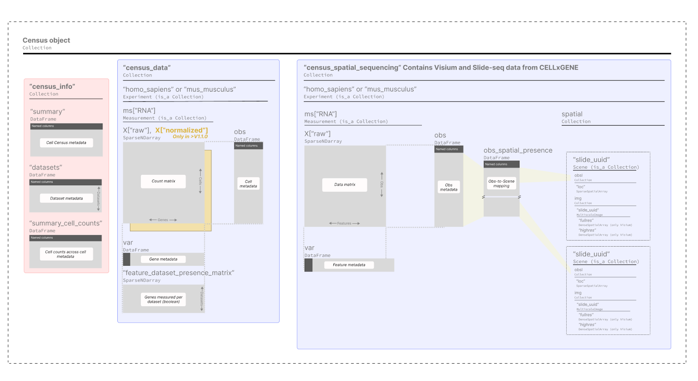

# Census data and schema

This page provides a user-friendly overview of the Census contents and its schema, in case you are interested you can find the full schema specification [here](https://github.com/chanzuckerberg/cellxgene-census/blob/main/docs/cellxgene_census_schema.md).

**Contents:**

1. [Schema](#schema)
2. [Data included in the Census](#data-included-in-the-census)
3. [SOMA objects](#soma-objects)

## Schema

The Census is a collection of a variety of **[SOMA objects](#soma-objects)** organized with the following hierarchy.

As you can see the Census data is a `SOMACollection` with two high-level items:

1. `"census_info"` for the census summary info.
2. `"census_data"` for the single-cell data and metadata.

### Census Summary Info `"census_info"`

A `SOMAcollection` with tables providing information of the census as a whole, it has the following items:

- `"summary"`: High-level information of this Census, e.g., build date, total cell count, etc.
- `"datasets"`: A table with all datasets from CELLxGENE Discover used to create the Census.
- `"summary_cell_counts"`: Cell counts stratified by relevant cell metadata.

---

### Census Single-Cell Data `"census_data"`

Data for each organism is stored in independent `SOMAExperiment` objects, which are a specialized form of a `SOMACollection`. Each of these stores a data matrix (cell by genes), cell metadata, gene metadata, and feature presence matrix.

This is how the data is organized for one organism – *Homo sapiens*:

- `["homo_sapiens"].obs`: Cell metadata.
- `["homo_sapiens"].ms["RNA"].X`: Data matrices: raw counts in `X["raw"]`, and library-size normalized counts in `X["normalized"]` (only available in Census schema V1.1.0 and above).
- `["homo_sapiens"].ms["RNA"].var`: Gene metadata.
- `["homo_sapiens"].ms["RNA"]["feature_dataset_presence_matrix"]`: A sparse boolean array indicating which genes were measured in each dataset.

---

### Data Included in the Census

All data from [CZ CELLxGENE Discover](https://cellxgene.cziscience.com/) that adheres to the following criteria is included in the Census:

- Cells from human or mouse.
- **Spatial and non-spatial RNA data**, see the full list of sequencing technologies included [here](https://github.com/chanzuckerberg/cellxgene-census/blob/main/docs/cellxgene_census_schema.md#assays).
- Raw counts.
- Only standardized cell and gene metadata as described in the CELLxGENE Discover dataset [schema](https://github.com/chanzuckerberg/single-cell-curation/blob/main/schema/3.0.0/schema.md).

⚠️ Note that the data includes:

- **Full-gene sequencing read counts** (e.g., Smart-Seq2) and **molecule counts** (e.g., 10X).
- **Duplicate cells** present across multiple datasets. These can be filtered in or out using the cell metadata variable `is_primary_data`.

---

### SOMA Objects

You can find the full SOMA specification [here](https://github.com/single-cell-data/SOMA/blob/main/abstract_specification.md#foundational-types).

The following is a short description of the main SOMA objects used by the Census:

- **`DenseNDArray`**: A dense, N-dimensional array, with offset (zero-based) integer indexing on each dimension.
- **`SparseNDArray`**: The same as `DenseNDArray` but sparse, and supports point indexing (disjoint index access).
- **`DataFrame`**: A multi-column table with user-defined column names and value types, with support for point indexing.
- **`Collection`**: A persistent container of named SOMA objects.
- **`Experiment`**: A class that represents a single-cell experiment. It always contains two objects:
  - `obs`: A `DataFrame` with primary annotations on the observation axis.
  - `ms`: A `Collection` of measurements, each composed of `X` matrices and axis annotation matrices or data frames (e.g., `var`, `varm`, `obsm`, etc.).
- **`SOMAScene`**: A `Collection` of `obsl`, `varl`, and `img`.
- **`Spatial`**: A collection of `Scene` objects.
- **`obs_spatial_presence`**: A `DataFrame` to map observations to `Scene` objects.
