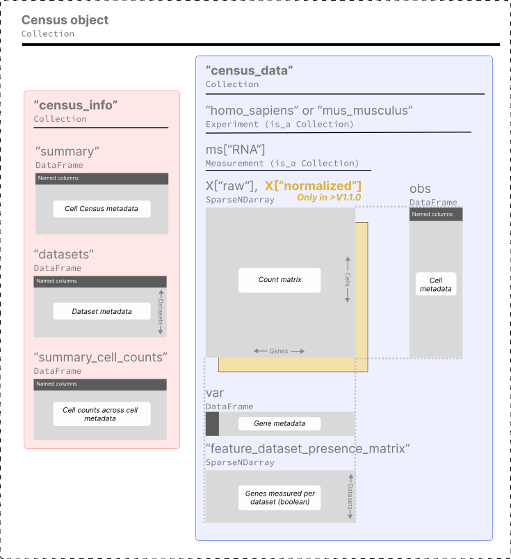

# Census data and schema

This page provides a user-friendly overview of the Census contents and its schema, in case you are interested you can find the full schema specification [here](https://github.com/chanzuckerberg/cellxgene-census/blob/main/docs/cellxgene_census_schema.md).

**Contents:**

1. [Schema](#schema)
2. [Data included in the Census](#data-included-in-the-census)
3. [SOMA objects](#soma-objects)

## Schema

The Census is a collection of a variety of **[SOMA objects](#soma-objects)** organized with the following hierarchy.

As you can see the Census data is a `SOMACollection` with two high-level items:

1. `"census_info"` for the census summary info.
2. `"census_data"` for the single-cell data and metadata.

### Census summary info `"census_info"`

A `SOMAcollection` with tables providing information of the census as a whole, it has the following items:

- `"summary"`: high-level information of this Census, e.g. build date, total cell count, etc.
- `"datasets"`: A table with all datasets from CELLxGENE Discover used to create the Census.
- `"summary_cell_counts"`: Cell counts stratified by relevant cell metadata.

### Census single-cell data `"census_data"`

Data for each organism is stored in independent `SOMAExperiment` objects which are a specialized form of a `SOMACollection`. Each of these store a data matrix (cell by genes), cell metadata, gene metadata, and feature presence matrix:

This is how the data is organized for one organism – *Homo sapiens*:

- `["homo_sapiens"].obs`: Cell metadata.
- `["homo_sapiens"].ms["RNA"].X`: Data matrices: raw counts in `X["raw"]`, and library-size normalized counts in `X["normalized"]` (only avialble in Census schema V1.1.0 and above).
- `["homo_sapiens"].ms["RNA"].var`: Gene Metadata.
- `["homo_sapiens"].ms["RNA"]["feature_dataset_presence_matrix"]`: a sparse boolean array indicating which genes were measured in each dataset.

## Data included in the Census

All data from [CZ CELLxGENE Discover](https://cellxgene.cziscience.com/) that adheres to the following criteria is included in the Census:

- Cells from human or mouse.
- Non-spatial RNA data, see full list of sequencing technologies included [here](https://github.com/chanzuckerberg/cellxgene-census/blob/main/docs/cellxgene_census_schema.md#assays).
- Raw counts.
- Only standardized cell and gene metadata as described in the CELLxGENE Discover dataset [schema](https://github.com/chanzuckerberg/single-cell-curation/blob/main/schema/3.0.0/schema.md).

⚠️ Note that the data includes:

- **Full-gene sequencing read counts** (e.g. Smart-Seq2) and **molecule counts** (e.g. 10X).
- **Duplicate cells** present across multiple datasets, these can be filtered in or out using the cell metadata variable `is_primary_data`.

## SOMA objects

You can find the full SOMA specification [here](https://github.com/single-cell-data/SOMA/blob/main/abstract_specification.md#foundational-types).

The following is short description of the main SOMA objects used by the Census:

- `DenseNDArray` is a dense, N-dimensional array, with offset (zero-based) integer indexing on each dimension.
- `SparseNDArray` is the same as `DenseNDArray` but sparse, and supports point indexing (disjoint index access).
- `DataFrame` is a multi-column table with a user-defined columns names and value types, with support for point indexing.
- `Collection` is a persistent container of named SOMA objects.
- `Experiment` is a class that represents a single-cell experiment. It always contains two objects:
  - `obs`: a  `DataFrame` with primary annotations on the observation axis.
  - `ms`: a  `Collection` of measurements, each composed of `X` matrices and axis annotation matrices or data frames (e.g. `var`, `varm`, `obsm`, etc).
